# Практическое занятие №1 (17): Разделение монолита на 2 микросервиса
## Выполнил: Туев Д. ЭФМО-01-25
 
## Содержание

1. [Описание проекта](#описание-проекта)
2. [Границы сервисов](#границы-сервисов)
3. [Архитектура решения](#архитектура-решения)
4. [API спецификация](#api-спецификация)
5. [Запуск сервисов](#запуск-сервисов)
6. [Тестирование](#тестирование)
7. [Скриншоты выполнения](#скриншоты-выполнения)
8. [Выводы](#выводы)

---

## Описание проекта

Проект представляет собой учебную систему из двух микросервисов, полученных путём декомпозиции монолитного приложения:

- **Auth service** — отвечает за аутентификацию и проверку токенов (упрощённая модель с фиксированным токеном).
- **Tasks service** — CRUD для задач, каждый запрос требует проверки токена через Auth service.

**Ключевые технологии:** Go, HTTP, REST, env-конфигурация, таймауты, request-id, базовое логирование.

**Цель работы:** Научиться декомпозировать небольшую систему на два сервиса и организовать корректное синхронное взаимодействие по HTTP с таймаутами, статусами ошибок и прокидыванием request-id.

---

## Границы сервисов

### Auth service
- Выдача токена (упрощённо — фиксированный токен `demo-token`)
- Проверка токена
- Возврат информации: валиден/не валиден

### Tasks service
- Хранение и управление задачами (in-memory хранилище)
- Перед выполнением операций проверка токена через Auth service
- Проксирование ошибок авторизации клиенту

---

## Архитектура решения

### Схема взаимодействия

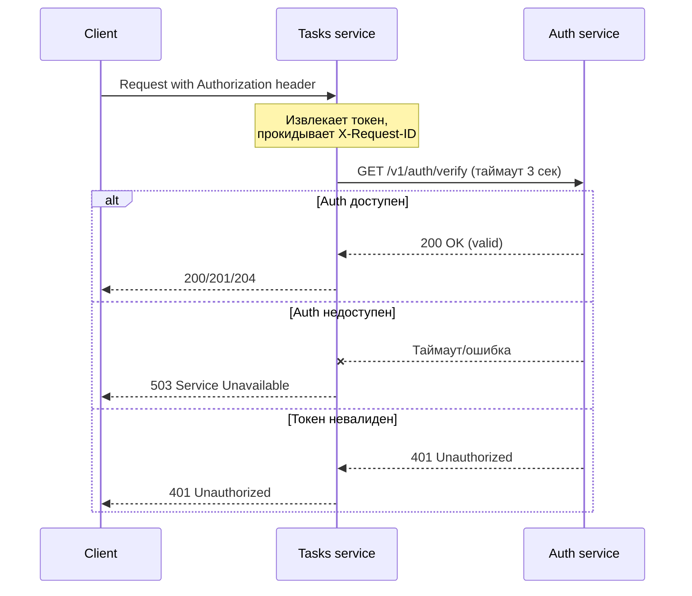

### Структура репозитория

```
tech-ip-sem2/
├── services/
│   ├── auth/
│   │   ├── cmd/
│   │   │   └── auth/
│   │   │       └── main.go
│   │   ├── internal/
│   │   │   ├── http/
│   │   │   │   └── handlers.go
│   │   │   └── service/
│   │   │       └── auth.go
│   │   └── go.mod
│   └── tasks/
│       ├── cmd/
│       │   └── tasks/
│       │       └── main.go
│       ├── internal/
│       │   ├── http/
│       │   │   └── handlers.go
│       │   ├── service/
│       │   │   └── tasks.go
│       │   └── client/
│       │       └── authclient/
│       │           └── client.go
│       └── go.mod
└── shared/
    ├── go.mod
    ├── middleware/
    │   ├── requestid.go
    │   └── logging.go
    └── httpx/
        └── client.go
```

---

## API спецификация

### Auth service

#### `POST /v1/auth/login` — получение токена

**Request Headers:**
- `Content-Type: application/json`
- `X-Request-ID` (опционально) — для трассировки

**Request Body:**
```json
{
    "username": "student",
    "password": "student"
}
```

**Response 200 OK:**
```json
{
    "access_token": "demo-token",
    "token_type": "Bearer"
}
```

**Response 400 Bad Request:**
```json
{
    "error": "Invalid request body"
}
```

**Response 401 Unauthorized:**
```json
{
    "error": "invalid credentials"
}
```

#### `GET /v1/auth/verify` — проверка токена

**Request Headers:**
- `Authorization: Bearer <token>`
- `X-Request-ID` (опционально)

**Response 200 OK:**
```json
{
    "valid": true,
    "subject": "student"
}
```

**Response 401 Unauthorized:**
```json
{
    "valid": false,
    "error": "unauthorized"
}
```

---

### Tasks service

Все защищённые эндпоинты требуют заголовок:
- `Authorization: Bearer <token>`
- `X-Request-ID` (опционально)

#### `POST /v1/tasks` — создание задачи

**Request Body:**
```json
{
    "title": "Read lecture",
    "description": "Prepare notes",
    "due_date": "2026-01-10"
}
```

**Response 201 Created:**
```json
{
    "id": "t_123456789",
    "title": "Read lecture",
    "description": "Prepare notes",
    "due_date": "2026-01-10",
    "done": false
}
```

#### `GET /v1/tasks` — список всех задач

**Response 200 OK:**
```json
[
    {
        "id": "t_001",
        "title": "Read lecture",
        "description": "Prepare notes",
        "due_date": "2026-01-10",
        "done": false
    },
    {
        "id": "t_002",
        "title": "Do practice",
        "done": true
    }
]
```

#### `GET /v1/tasks/{id}` — получение задачи по ID

**Response 200 OK:**
```json
{
    "id": "t_001",
    "title": "Read lecture",
    "description": "Prepare notes",
    "due_date": "2026-01-10",
    "done": false
}
```

**Response 404 Not Found:**
```json
{
    "error": "task not found"
}
```

#### `PATCH /v1/tasks/{id}` — обновление задачи

**Request Body** (все поля опциональны):
```json
{
    "title": "Updated title",
    "description": "Updated description",
    "due_date": "2026-02-01",
    "done": true
}
```

**Response 200 OK:** обновлённая задача (аналогично GET)

**Response 404 Not Found:**
```json
{
    "error": "task not found"
}
```

#### `DELETE /v1/tasks/{id}` — удаление задачи

**Response 204 No Content** (без тела)

**Response 404 Not Found:**
```json
{
    "error": "task not found"
}
```

### Общие ошибки для Tasks service

| Код | Описание | Тело ответа |
|-----|----------|-------------|
| 400 | Неверный формат запроса | `{"error":"invalid request body"}` |
| 401 | Отсутствует или невалидный токен | `{"error":"missing authorization header"}` / `{"error":"invalid token"}` |
| 503 | Auth service недоступен | `{"error":"authentication service unavailable"}` |
| 404 | Задача не найдена | `{"error":"task not found"}` |

---

## Запуск сервисов

### Предварительные требования

- Go версии 1.22 или выше
- Свободные порты 8081 и 8082 (или другие, заданные через переменные окружения)

### Переменные окружения

**Auth service:**
- `AUTH_PORT` — порт для сервиса аутентификации (по умолчанию `8081`)

**Tasks service:**
- `TASKS_PORT` — порт для сервиса задач (по умолчанию `8082`)
- `AUTH_BASE_URL` — базовый URL Auth service (по умолчанию `http://localhost:8081`)

### Команды для запуска

#### Терминал 1 (Auth service)

```bash
cd services/auth
go mod tidy
export AUTH_PORT=8081
go run ./cmd/auth
```

Ожидаемый вывод:
```
Auth service starting on :8081
```

#### Терминал 2 (Tasks service)

```bash
cd services/tasks
go mod tidy
export TASKS_PORT=8082
export AUTH_BASE_URL=http://localhost:8081
go run ./cmd/tasks
```

Ожидаемый вывод:
```
Tasks service starting on :8082
```

---

## Тестирование

### Ручное тестирование через curl

#### 1. Получение токена

```bash
curl -s -X POST http://localhost:8081/v1/auth/login \
  -H "Content-Type: application/json" \
  -H "X-Request-ID: req-001" \
  -d '{"username":"student","password":"student"}'
```

**Ожидаемый ответ:**
```json
{"access_token":"demo-token","token_type":"Bearer"}
```

#### 2. Проверка токена напрямую

```bash
curl -i http://localhost:8081/v1/auth/verify \
  -H "Authorization: Bearer demo-token" \
  -H "X-Request-ID: req-002"
```

**Ожидаемый ответ:**
```json
{"valid":true,"subject":"student"}
```

#### 3. Создание задачи (с валидным токеном)

```bash
curl -i -X POST http://localhost:8082/v1/tasks \
  -H "Content-Type: application/json" \
  -H "Authorization: Bearer demo-token" \
  -H "X-Request-ID: req-003" \
  -d '{"title":"Do PZ17","description":"split services","due_date":"2026-01-10"}'
```

**Ожидаемый ответ:**
```json
{
  "id": "t_123456789",
  "title": "Do PZ17",
  "description": "split services",
  "due_date": "2026-01-10",
  "done": false
}
```

#### 4. Попытка создания задачи без токена

```bash
curl -i -X POST http://localhost:8082/v1/tasks \
  -H "Content-Type: application/json" \
  -H "X-Request-ID: req-004" \
  -d '{"title":"Should fail"}'
```

**Ожидаемый ответ:** 401 Unauthorized

```json
{"error":"missing authorization header"}
```

#### 5. Попытка создания задачи с неверным токеном

```bash
curl -i -X POST http://localhost:8082/v1/tasks \
  -H "Content-Type: application/json" \
  -H "Authorization: Bearer wrong-token" \
  -H "X-Request-ID: req-005" \
  -d '{"title":"Should fail"}'
```

**Ожидаемый ответ:** 401 Unauthorized

```json
{"error":"invalid token"}
```

#### 6. Проверка таймаута (остановите Auth service)

```bash
# Остановите Auth service (Ctrl+C)
# Затем выполните запрос к Tasks
curl -i -X POST http://localhost:8082/v1/tasks \
  -H "Content-Type: application/json" \
  -H "Authorization: Bearer demo-token" \
  -H "X-Request-ID: req-006" \
  -d '{"title":"Test timeout"}'
```

**Ожидаемый ответ:** 503 Service Unavailable

```json
{"error":"authentication service unavailable"}
```

---

## Скриншоты выполнения


### 1. Запуск сервисов


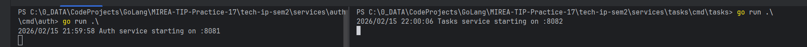


### 2. Получение токена (POST /v1/auth/login)


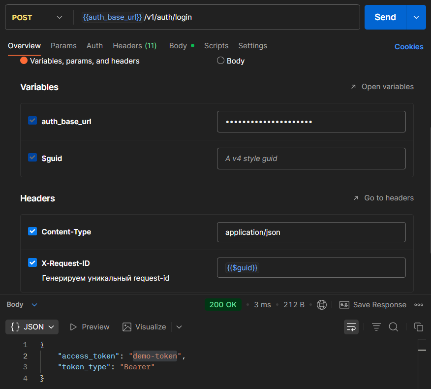


### 3. Создание задачи с валидным токеном


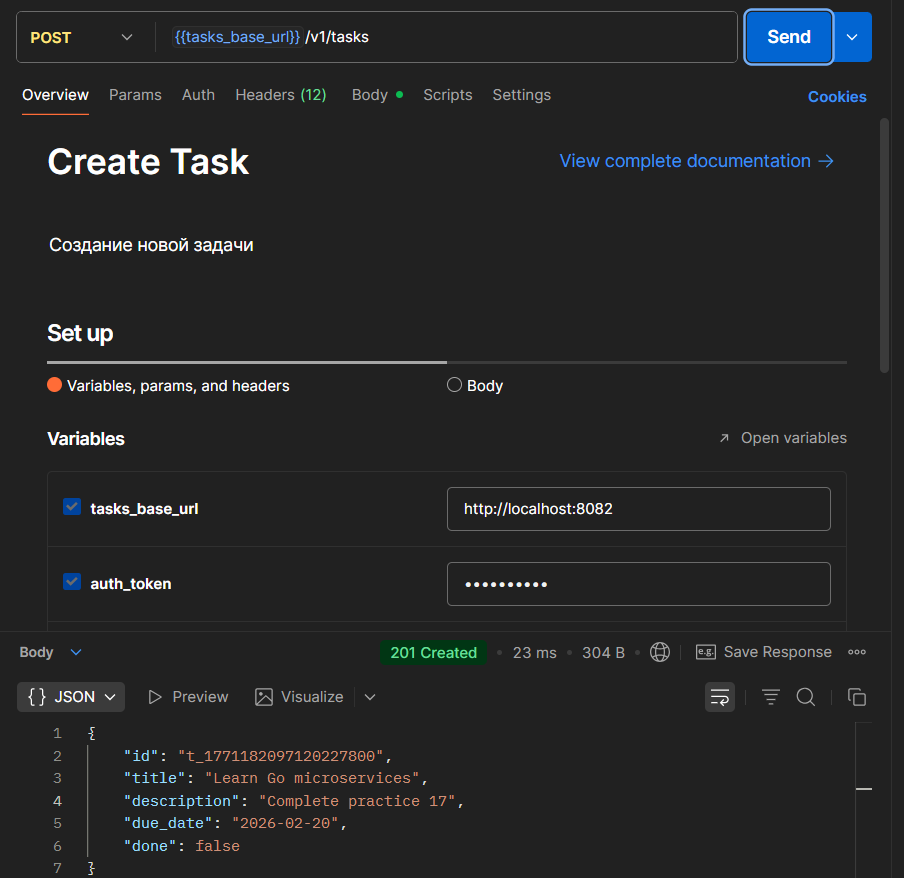

### 4. Прокидывание request-id (логи)


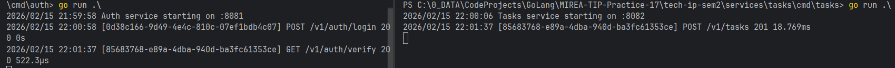

### 5. Ошибка при отсутствии токена


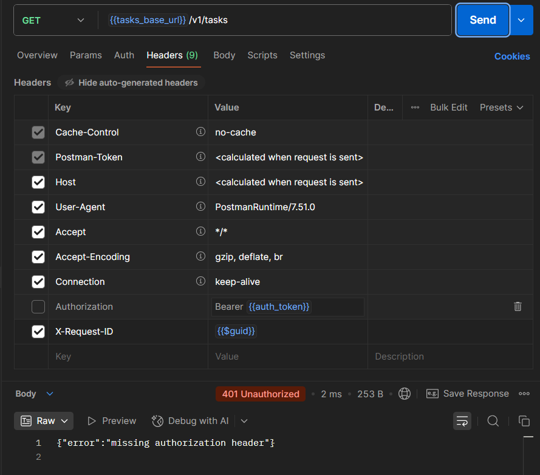

### 6. Ошибка при неверном токене

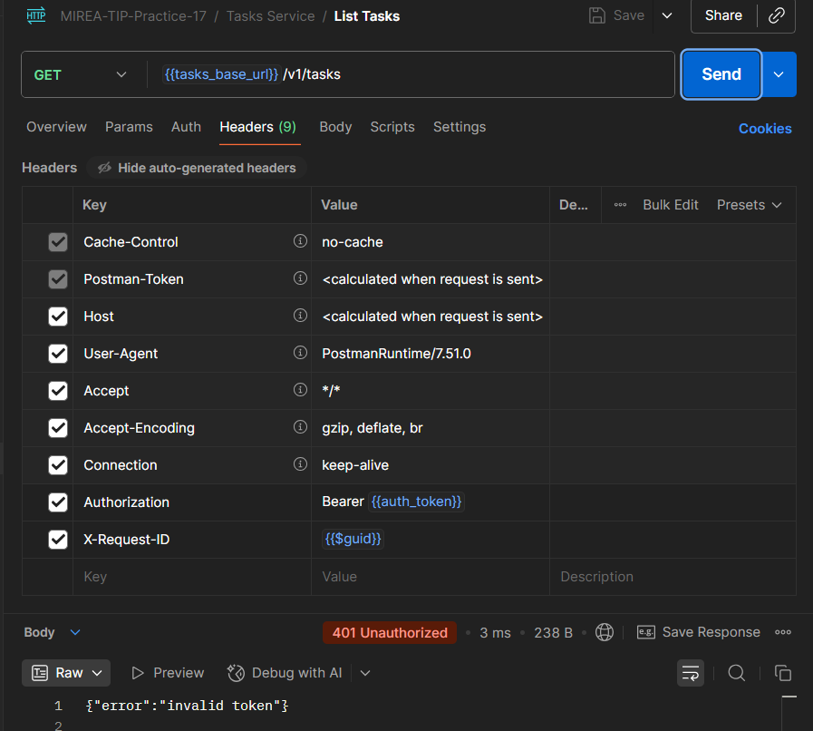

### 7. Таймаут при недоступном Auth service

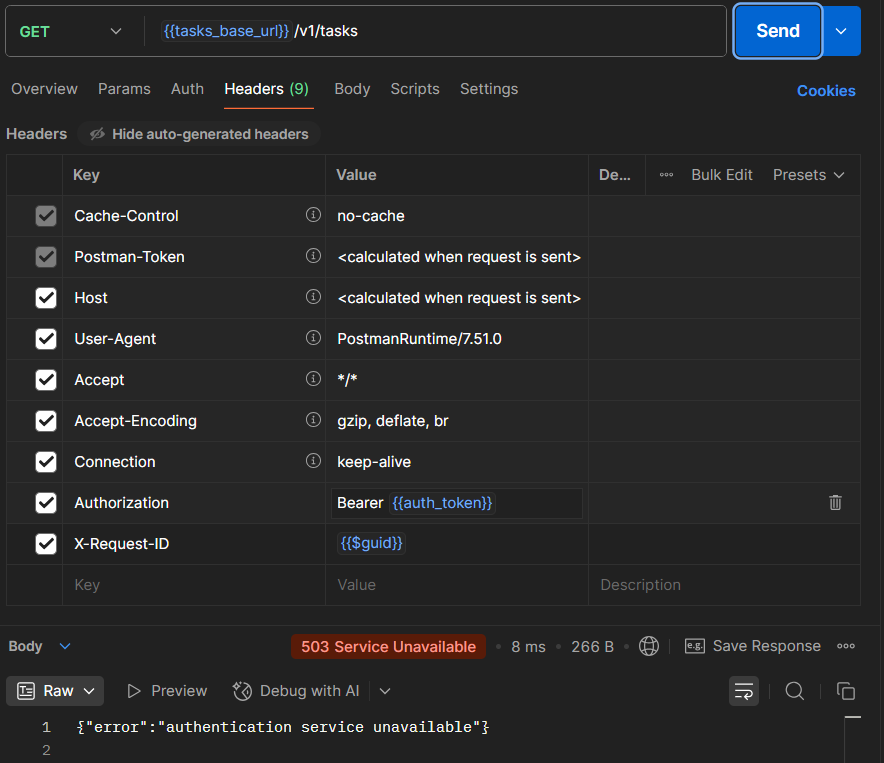

### 8. Список задач

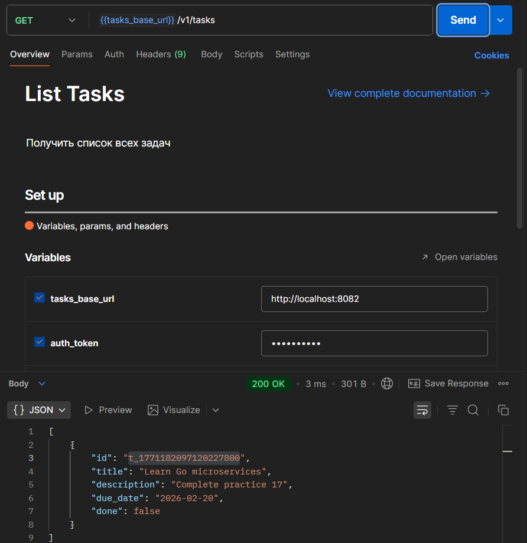

### 9. Обновление задачи

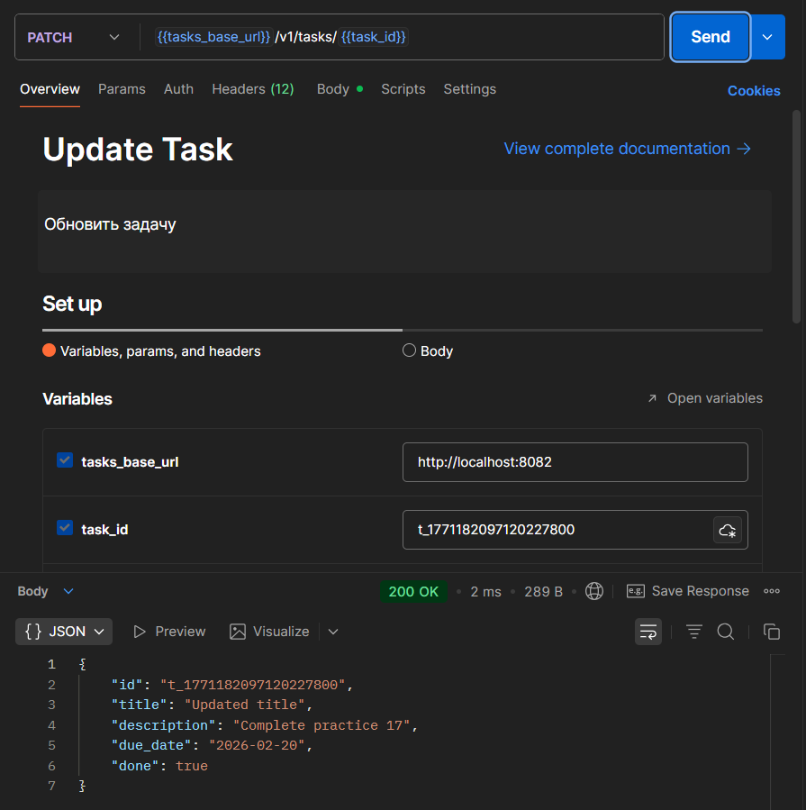

### 10. Удаление задачи

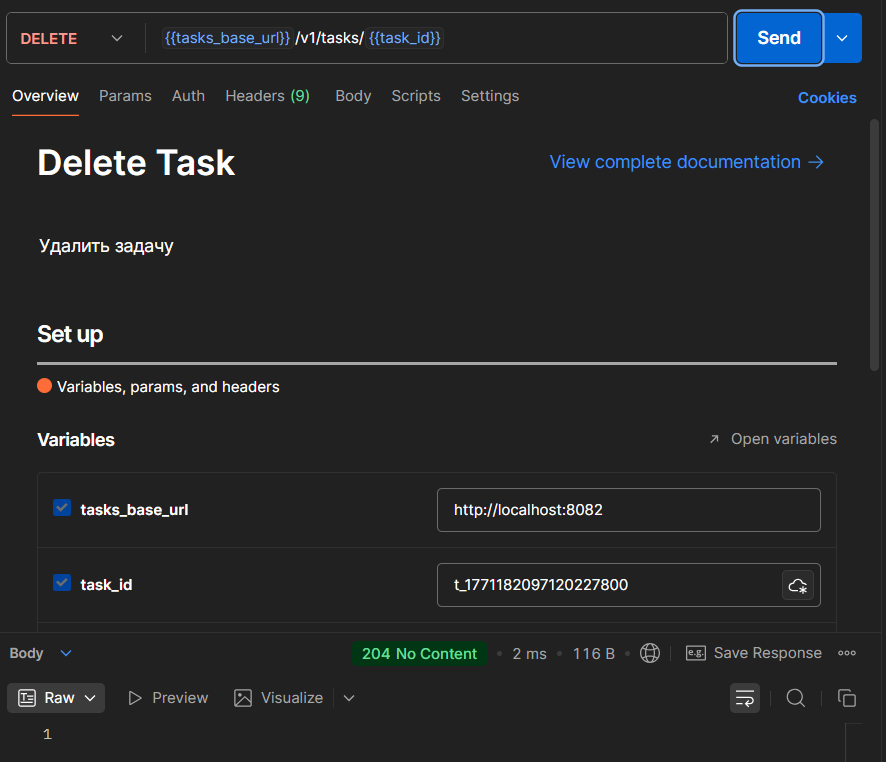

---

## Выводы

В ходе выполнения практического занятия были достигнуты следующие результаты:

1. **Декомпозиция монолита** — исходное монолитное приложение разделено на два независимых микросервиса с чёткими границами ответственности.

2. **Реализация синхронного взаимодействия** — Tasks service вызывает Auth service по HTTP для проверки токена перед выполнением операций.

3. **Обработка таймаутов** — HTTP-клиент Tasks service настроен с таймаутом 3 секунды, при недоступности Auth возвращается 503.

4. **Прокидывание request-id** — реализовано middleware, которое читает/генерирует X-Request-ID и передаёт его в контексте, включая исходящие запросы к Auth. Это обеспечивает сквозную трассировку запросов.

5. **Логирование** — каждый входящий запрос логируется с указанием request-id, метода, пути, статуса и времени выполнения.

6. **Обработка ошибок** — корректно различаются случаи отсутствия токена, неверного токена и недоступности сервиса аутентификации.

7. **Конфигурация через окружение** — порты и адреса сервисов задаются через переменные окружения, что позволяет гибко разворачивать систему.

Все требования, указанные в задании, выполнены. Система готова к демонстрации и дальнейшему расширению (например, подключение реальной базы данных, добавление JWT, ретраев и т.д.).

---

## Контрольные вопросы (ответы)

### 1. Почему межсервисный вызов должен иметь таймаут?

Таймаут необходим для предотвращения зависания сервиса при недоступности вызываемого сервиса. Без таймаута запрос может заблокировать горутину (или поток) на неопределённое время, что приведёт к исчерпанию ресурсов и отказу в обслуживании других клиентов. Таймаут также позволяет быстро вернуть клиенту понятную ошибку (например, 503) вместо бесконечного ожидания.

### 2. Чем request-id помогает при диагностике ошибок?

Request-id позволяет связать воедино все логи, сгенерированные в рамках одного пользовательского запроса, даже при прохождении через несколько сервисов. При возникновении ошибки можно найти все связанные записи в логах Auth и Tasks по одному идентификатору, что значительно упрощает трассировку и отладку распределённых систем.

### 3. Какие статусы нужно вернуть клиенту при невалидном токене?

При невалидном токене следует вернуть статус **401 Unauthorized**. Это стандартный HTTP-статус для случаев отсутствия аутентификации или её недействительности. Важно не возвращать 200 с телом, содержащим ошибку, так как клиенты и прокси полагаются на статус-коды для принятия решений (например, сброс авторизации).

### 4. Чем опасно "делить одну БД" между сервисами?

Разделение одной базы данных между несколькими сервисами нарушает принцип слабой связанности (loose coupling) микросервисной архитектуры:
- Изменение схемы БД одним сервисом может сломать другие.
- Появляется неявная зависимость от внутренней структуры данных.
- Сложнее масштабировать (нельзя независимо масштабировать сервисы).
- Усложняется выбор разных технологий хранения для разных сервисов.
- Теряется изоляция сбоев (сбой БД останавливает все сервисы).

Правильный подход — каждый сервис владеет своими данными и предоставляет доступ к ним только через свой API.

---

## Приложение: Postman коллекция

В репозитории доступна [Postman коллекция](https://www.postman.com/lively-flare-564043/workspace/learning/collection/42992055-840983f9-8b75-41a0-ba8b-3be8e762494e?action=share&source=copy-link&creator=42992055) со всеми запросами. Для использования:

1. Импортируйте коллекцию в Postman
2. Создайте окружение с переменными:
    - `auth_base_url`: `http://localhost:8081`
    - `tasks_base_url`: `http://localhost:8082`
    - `auth_token`: `demo-token`
3. Выполняйте запросы в любом порядке (токен уже предустановлен)

---
